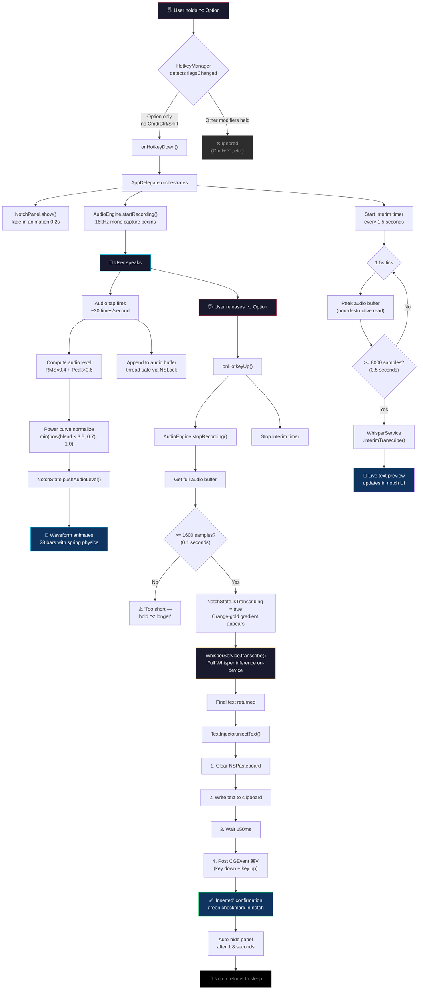

<p align="center">
  <br/>
  <br/>
</p>

<h1 align="center">
  <br/>
  
  <br/>
  WhisperNotch
  <br/>
</h1>

<p align="center">
  <em>Your Mac's notch just learned to listen.</em>
</p>

<p align="center">
  
  
  
  
  
</p>

<p align="center">
  <strong>Hold ⌥ Option</strong> in any text field · <strong>Speak</strong> · <strong>Release</strong> · Your words appear ✨
</p>

---

<br/>

## 🎬 The Experience

```
╔══════════════════════════════════════════════════════════════════╗
║                                                                  ║
║    You're typing an email. Mid-thought, you pause.               ║
║                                                                  ║
║    You hold ⌥ Option.                                            ║
║                                                                  ║
║    The notch awakens — a pill of obsidian glass expands,         ║
║    pulsing with a cyan-to-purple gradient.                       ║
║    28 bars of waveform dance to your voice in real-time.         ║
║                                                                  ║
║    "Schedule the meeting for Thursday at 3 PM"                   ║
║                                                                  ║
║    You release the key. A brief shimmer of orange-gold.          ║
║    The text materializes in your email — as if you typed it.     ║
║                                                                  ║
║    The notch fades back to sleep.                                ║
║                                                                  ║
║    No internet. No cloud. No latency.                            ║
║    Just your voice, your Mac, and a Whisper.                     ║
║                                                                  ║
╚══════════════════════════════════════════════════════════════════╝
```

<br/>

## 🧠 What is WhisperNotch?

**WhisperNotch** is a macOS-native speech-to-text utility that transforms your MacBook's notch into an intelligent voice interface. Built entirely in Swift, it captures your voice, runs OpenAI's Whisper model **locally on-device** via Apple's Core ML, and injects the transcribed text directly into whatever app you're using.

No accounts. No API keys. No data leaving your machine. **Ever.**

<br/>

> **The Philosophy:** *The best interface is the one that disappears.* WhisperNotch has no window, no dock icon, no friction. It lives in the notch — the one part of your screen you never use — and activates with a single key hold.

<br/>

---

## ✨ Feature Constellation

<table>
<tr>
<td width="50%">

### 🎙️ Voice Capture
- 16 kHz mono Float32 audio pipeline
- AVAudioEngine with 1024-byte tap buffer
- RMS + Peak blended metering with power curve normalization
- Thread-safe buffer via NSLock

</td>
<td width="50%">

### 🧪 On-Device AI
- OpenAI Whisper via WhisperKit (Core ML)
- 6 model variants: tiny → small (39–244 MB)
- English-only (.en) variants for enhanced accuracy
- Hot-swappable models without restart

</td>
</tr>
<tr>
<td>

### 🌊 Live Waveform
- 28-bar real-time audio visualization
- Spring-physics animation (0.12s response, 0.7 damping)
- Color-reactive: purple → blue → cyan-white by intensity
- ~30 FPS driven by actual microphone levels

</td>
<td>

### 💉 Text Injection
- Clipboard write + synthetic ⌘V via CGEvent
- Works in any app — browsers, editors, terminals
- Graceful fallback: manual paste if no Accessibility
- 150ms debounced injection for reliability

</td>
</tr>
<tr>
<td>

### 🔮 Interim Transcription
- Live text preview while you're still speaking
- 1.5s polling cycle with partial audio peek
- Watch your words form in real-time
- Final pass ensures full accuracy on release

</td>
<td>

### 🖤 Notch-Native UI
- Custom `NotchShape` path hugging the hardware notch
- Animated gradient borders: cyan↔purple (listening), orange↔gold (processing)
- Pulsing glow effect with 1.2s breathing cycle
- Always-on-top floating panel across all Spaces

</td>
</tr>
</table>

<br/>

---

## 🏛️ Architecture

WhisperNotch follows a clean **Service-Oriented Architecture** with SwiftUI reactive state management. Each layer has a single responsibility, and the `AppDelegate` acts as the central orchestrator binding everything together.

```
┌─────────────────────────────────────────────────────────────────────────┐
│                          WhisperNotch Architecture                      │
│                                                                         │
│  ┌───────────────────────────────────────────────────────────────────┐  │
│  │                        🎨 PRESENTATION LAYER                      │  │
│  │                                                                   │  │
│  │   ┌─────────────┐   ┌──────────────────┐   ┌────────────────┐   │  │
│  │   │ NotchPanel   │   │ NotchContentView │   │  SettingsView  │   │  │
│  │   │  (NSPanel)   │◄──│    (SwiftUI)     │   │   (SwiftUI)    │   │  │
│  │   │  floating    │   │  waveform, text  │   │  model picker  │   │  │
│  │   │  window      │   │  states, glow    │   │  permissions   │   │  │
│  │   └──────────────┘   └────────┬─────────┘   └────────────────┘   │  │
│  │                               │ @ObservedObject                   │  │
│  └───────────────────────────────┼───────────────────────────────────┘  │
│                                  │                                      │
│  ┌───────────────────────────────┼───────────────────────────────────┐  │
│  │                      📊 STATE LAYER                               │  │
│  │                               │                                   │  │
│  │                    ┌──────────▼──────────┐                        │  │
│  │                    │    NotchState        │                        │  │
│  │                    │  ─────────────────   │                        │  │
│  │                    │  isListening         │                        │  │
│  │                    │  isTranscribing      │                        │  │
│  │                    │  transcribedText     │                        │  │
│  │                    │  audioLevels[28]     │                        │  │
│  │                    │  statusMessage       │                        │  │
│  │                    └──────────▲──────────┘                        │  │
│  │                               │ @Published                        │  │
│  └───────────────────────────────┼───────────────────────────────────┘  │
│                                  │                                      │
│  ┌───────────────────────────────┼───────────────────────────────────┐  │
│  │                    🎯 ORCHESTRATION LAYER                         │  │
│  │                               │                                   │  │
│  │                    ┌──────────▼──────────┐                        │  │
│  │                    │    AppDelegate       │                        │  │
│  │                    │  ─────────────────   │                        │  │
│  │                    │  Binds hotkey events │                        │  │
│  │                    │  Manages audio flow  │                        │  │
│  │                    │  Coordinates AI      │                        │  │
│  │                    │  Controls UI panel   │                        │  │
│  │                    │  Runs interim timer  │                        │  │
│  │                    └──┬───┬───┬───┬──────┘                        │  │
│  │                       │   │   │   │                                │  │
│  └───────────────────────┼───┼───┼───┼────────────────────────────────┘  │
│                          │   │   │   │                                   │
│  ┌───────────────────────┼───┼───┼───┼────────────────────────────────┐  │
│  │                   ⚙️  SERVICE LAYER                                │  │
│  │                       │   │   │   │                                │  │
│  │   ┌───────────────────▼┐ │   │  ┌▼──────────────────┐            │  │
│  │   │   HotkeyManager    │ │   │  │   TextInjector    │            │  │
│  │   │  ────────────────  │ │   │  │  ───────────────  │            │  │
│  │   │  NSEvent monitor   │ │   │  │  NSPasteboard     │            │  │
│  │   │  CGEvent tap       │ │   │  │  CGEvent ⌘V       │            │  │
│  │   │  ⌥ Option detect   │ │   │  │  150ms debounce   │            │  │
│  │   └────────────────────┘ │   │  └───────────────────┘            │  │
│  │                          │   │                                    │  │
│  │   ┌──────────────────────▼┐ ┌▼──────────────────────┐            │  │
│  │   │    AudioEngine        │ │   WhisperService       │            │  │
│  │   │  ────────────────────│ │  ────────────────────  │            │  │
│  │   │  AVAudioEngine        │ │  WhisperKit wrapper    │            │  │
│  │   │  16kHz mono capture   │ │  Core ML inference     │            │  │
│  │   │  RMS+Peak metering    │ │  6 model variants      │            │  │
│  │   │  Accelerate.framework │ │  Lazy model loading    │            │  │
│  │   └───────────────────────┘ └───────────────────────┘            │  │
│  │                                                                   │  │
│  └───────────────────────────────────────────────────────────────────┘  │
│                                                                         │
│  ┌───────────────────────────────────────────────────────────────────┐  │
│  │                      🍎 SYSTEM LAYER                              │  │
│  │                                                                   │  │
│  │   AVFoundation  ·  Accelerate  ·  AppKit  ·  Carbon.HIToolbox    │  │
│  │   CoreGraphics  ·  Core ML     ·  SwiftUI ·  NSAccessibility     │  │
│  │                                                                   │  │
│  └───────────────────────────────────────────────────────────────────┘  │
│                                                                         │
└─────────────────────────────────────────────────────────────────────────┘
```

<br/>

---

## 🔄 The Lifecycle — A Journey of Sound to Text

This is the complete flow of what happens when you hold ⌥ Option and speak.



<br/>

---

## 🔬 Deep Dive: The Audio Pipeline

The audio processing pipeline is where physics meets perception. Here's how raw microphone data becomes a dancing waveform:

```
                    ┌──────────────────────────────────┐
                    │         MICROPHONE INPUT          │
                    │     (native hardware format)      │
                    └──────────────┬───────────────────┘
                                   │
                                   ▼
                    ┌──────────────────────────────────┐
                    │       AVAudioEngine Tap           │
                    │    1024-byte buffer chunks         │
                    │    fires ~30 times per second      │
                    └──────────────┬───────────────────┘
                                   │
                         ┌─────────┴─────────┐
                         ▼                   ▼
              ┌─────────────────┐  ┌──────────────────┐
              │  FORMAT CONVERT  │  │  LEVEL METERING   │
              │                 │  │                    │
              │  Native format  │  │  ┌──────────────┐ │
              │       ↓         │  │  │ vDSP_rmsqv   │ │
              │  AVAudioConvert │  │  │ (RMS energy)  │ │
              │       ↓         │  │  └──────┬───────┘ │
              │  16 kHz mono    │  │         │         │
              │  Float32        │  │  ┌──────▼───────┐ │
              │                 │  │  │ vDSP_maxmgv  │ │
              │                 │  │  │ (peak level)  │ │
              │                 │  │  └──────┬───────┘ │
              └────────┬────────┘  │         │         │
                       │           │  ┌──────▼───────┐ │
                       │           │  │    BLEND      │ │
                       │           │  │ rms×0.4       │ │
                       │           │  │  + peak×0.6   │ │
                       │           │  └──────┬───────┘ │
                       │           │         │         │
                       │           │  ┌──────▼───────┐ │
                       │           │  │  NORMALIZE    │ │
                       │           │  │  pow(x×3.5,   │ │
                       │           │  │      0.7)     │ │
                       │           │  │  capped @1.0  │ │
                       │           │  └──────┬───────┘ │
                       │           └─────────┼────────┘
                       │                     │
                       ▼                     ▼
              ┌─────────────────┐  ┌──────────────────┐
              │  AUDIO BUFFER   │  │  WAVEFORM UI      │
              │  ─────────────  │  │  ──────────────   │
              │  Thread-safe    │  │  28-bar rolling    │
              │  NSLock guard   │  │  buffer display    │
              │  Continuous     │  │  Spring-animated   │
              │  append         │  │  Color-reactive    │
              └────────┬────────┘  └──────────────────┘
                       │
                       ▼
              ┌─────────────────┐
              │  WHISPER MODEL  │
              │  ─────────────  │
              │  Core ML        │
              │  On-device      │
              │  inference      │
              └─────────────────┘
```

### Why RMS + Peak Blending?

| Method | Pros | Cons |
|--------|------|------|
| **RMS only** | Smooth, energy-accurate | Sluggish, misses transients |
| **Peak only** | Responsive, catches plosives | Jittery, visually noisy |
| **Blended (40/60)** | Best of both — smooth yet responsive | — |

The **power curve** `pow(x × 3.5, 0.7)` serves two purposes:
1. **Amplification** (`× 3.5`): Quiet speech becomes visible
2. **Compression** (`^0.7`): Loud sounds don't clip — dynamic range is preserved

<br/>

---

## 🏗️ Project Structure

```
WhisperNotch/
│
├── 📦 Package.swift                    # SPM manifest — WhisperKit ≥ 0.9.0
├── 🔧 project.yml                     # XcodeGen project definition
├── 📀 build-dmg.sh                    # DMG installer builder
├── ⚡ setup.sh                        # Project bootstrap script
│
└── WhisperNotch/
    │
    ├── Sources/
    │   │
    │   ├── App/                        # ── Application Core ──
    │   │   ├── WhisperNotchApp.swift   #    @main entry, SwiftUI lifecycle
    │   │   └── AppDelegate.swift       #    🧠 The brain — orchestrates everything
    │   │
    │   ├── Models/                     # ── State Management ──
    │   │   └── NotchState.swift        #    Observable state container
    │   │
    │   ├── Services/                   # ── Business Logic ──
    │   │   ├── AudioEngine.swift       #    🎤 Mic → 16kHz Float32 pipeline
    │   │   ├── WhisperService.swift    #    🤖 WhisperKit AI wrapper
    │   │   ├── HotkeyManager.swift     #    ⌨️  Global ⌥ key detection
    │   │   └── TextInjector.swift      #    💉 Clipboard + ⌘V injection
    │   │
    │   └── Views/                      # ── User Interface ──
    │       ├── NotchPanel.swift        #    🖤 Floating NSPanel at notch
    │       ├── NotchContentView.swift  #    🌊 SwiftUI waveform + states
    │       └── SettingsView.swift      #    ⚙️  Model picker & permissions
    │
    ├── Info.plist                       # Bundle metadata (LSUIElement: true)
    ├── WhisperNotch.entitlements        # Audio input + network client
    └── Assets.xcassets/                 # App icon & asset catalog
```

### Source Files at a Glance

| File | Lines | Role | Key Insight |
|------|:-----:|------|-------------|
| `AppDelegate.swift` | 272 | Orchestrator | Binds all services, manages lifecycle, runs interim timer |
| `NotchContentView.swift` | 237 | Main UI | Custom shape, gradient borders, waveform, 4 state views |
| `SettingsView.swift` | 186 | Settings | Model picker with size/speed/accuracy descriptions |
| `HotkeyManager.swift` | 146 | Input | NSEvent monitor + CGEvent tap with Accessibility polling |
| `AudioEngine.swift` | 114 | Capture | Accelerate-powered metering, format conversion |
| `NotchPanel.swift` | 97 | Window | Screen-saver level panel, fade animations |
| `WhisperService.swift` | 90 | AI | Lazy model loading, interim + final transcription |
| `TextInjector.swift` | 38 | Output | Thread-safe clipboard write + synthetic paste |
| `NotchState.swift` | 27 | State | Observable properties + 28-sample rolling buffer |
| `WhisperNotchApp.swift` | 15 | Entry | @main, delegates to AppDelegate |

**Total:** ~1,232 lines of Swift — lean, focused, no bloat.

<br/>

---

## 🧩 Component Deep Dives

<details>
<summary><b>⌨️ HotkeyManager — The Sentinel</b></summary>

<br/>

The HotkeyManager uses a **two-tier detection system**:

**Tier 1 — NSEvent Global Monitor** (always works):
```
NSEvent.addGlobalMonitorForEvents(matching: .flagsChanged) { event in
    let optionHeld = event.modifierFlags.contains(.option)
    let hasOthers  = event.modifierFlags.contains([.command, .control, .shift])

    if optionHeld && !hasOthers → onHotkeyDown()
    if !optionHeld             → onHotkeyUp()
}
```

**Tier 2 — CGEvent Tap** (requires Accessibility):
```
CGEvent.tapCreate(tap: .cgAnnotatedSessionEventTap, ...)
```
- Required for posting synthetic ⌘V events
- Polls `AXIsProcessTrusted()` every 2 seconds until granted
- Once trusted, creates tap and enables auto-paste

**Why two tiers?** The app works immediately after launch (Tier 1), even before the user grants Accessibility. Auto-paste unlocks when they do (Tier 2).

</details>

<details>
<summary><b>🎤 AudioEngine — The Ear</b></summary>

<br/>

The AudioEngine maintains a **thread-safe circular recording** with two read modes:

| Method | Behavior | Used By |
|--------|----------|---------|
| `getRecordedAudio()` | Returns buffer and **clears** it | Final transcription |
| `peekRecordedAudio()` | Returns buffer **without clearing** | Interim transcription |

**Audio Format Pipeline:**
```
Microphone (native: 44.1/48 kHz stereo)
    ↓ AVAudioConverter
Whisper-ready (16 kHz mono Float32)
    ↓ NSLock-guarded append
Thread-safe audio buffer
```

**Level Metering** uses Apple's **Accelerate framework** (SIMD-optimized):
- `vDSP_rmsqv` — Root Mean Square (energy envelope)
- `vDSP_maxmgv` — Maximum magnitude (transient detection)

</details>

<details>
<summary><b>🤖 WhisperService — The Brain</b></summary>

<br/>

Wraps [WhisperKit](https://github.com/argmaxinc/WhisperKit) for seamless Core ML inference.

**Available Models:**

| Model | Size | Speed | Accuracy | Best For |
|-------|------|-------|----------|----------|
| `tiny` | ~39 MB | ⚡⚡⚡ | ★★☆ | Quick notes, commands |
| `tiny.en` | ~39 MB | ⚡⚡⚡ | ★★★ | English-only, fastest |
| `base` | ~74 MB | ⚡⚡ | ★★★ | General dictation (default) |
| `base.en` | ~74 MB | ⚡⚡ | ★★★★ | English dictation |
| `small` | ~244 MB | ⚡ | ★★★★ | Multilingual, complex speech |
| `small.en` | ~244 MB | ⚡ | ★★★★★ | Best English accuracy |

**Two Transcription Modes:**
1. **`interimTranscribe()`** — Best-effort on partial audio (≥0.5s). Used for live preview.
2. **`transcribe()`** — Full accuracy on complete audio buffer. Used on key release.

Models are lazy-loaded on first launch and cached by WhisperKit for instant subsequent starts.

</details>

<details>
<summary><b>🖤 NotchPanel — The Stage</b></summary>

<br/>

A carefully configured `NSPanel` that integrates with the hardware notch:

```
NSPanel Configuration:
├── Style:      borderless, non-activating
├── Level:      .screenSaver (above everything)
├── Size:       520 × 120 points
├── Position:   centered at screen top (notch area)
├── Background: transparent (SwiftUI renders the shape)
├── Behavior:   canJoinAllSpaces, stationary, fullScreenAuxiliary
└── Interaction: ignoresMouseEvents (click-through)
```

**Animations:**
- **Show:** `alphaValue` 0 → 1 over 0.2s (ease-in)
- **Hide:** `alphaValue` 1 → 0 over 0.25s (ease-out), then `orderOut`

The panel is **completely non-interactive** — clicks pass through to whatever is behind it. It's a heads-up display, not a window.

</details>

<details>
<summary><b>🌊 NotchContentView — The Canvas</b></summary>

<br/>

The SwiftUI view renders four distinct states:

```
┌─────────────────────────────────────────────┐
│              STATE MACHINE                   │
│                                              │
│  ┌──────────┐  isListening    ┌───────────┐ │
│  │  IDLE    ├────────────────►│ LISTENING  │ │
│  │          │                 │ 🌊 waveform│ │
│  └──────────┘                 │ 💬 interim │ │
│       ▲                       └─────┬──────┘ │
│       │                             │ release │
│       │                       ┌─────▼──────┐ │
│       │                       │TRANSCRIBING│ │
│       │                       │ ⏳ spinner  │ │
│       │                       │ orange glow│ │
│       │                       └─────┬──────┘ │
│       │                             │ done   │
│       │ 1.8s                  ┌─────▼──────┐ │
│       └───────────────────────│   DONE     │ │
│                               │ ✅ text    │ │
│                               │ "Inserted" │ │
│                               └────────────┘ │
└─────────────────────────────────────────────┘
```

**Visual Design Language:**
- **Background:** Solid black `NotchShape` (pill with 10pt top / 20pt bottom corners)
- **Border (listening):** Cyan ↔ Purple linear gradient, pulsing glow
- **Border (transcribing):** Orange ↔ Gold linear gradient
- **Shadow:** Black 0.6 opacity, 16pt blur, 6pt Y offset
- **Typography:** SF Rounded, semibold/medium weights

</details>

<br/>

---

## 🚀 Getting Started

### Prerequisites

| Requirement | Details |
|-------------|---------|
| **macOS** | 14.0 Sonoma or later |
| **Chip** | Apple Silicon (M1/M2/M3/M4) recommended |
| **Xcode** | 15.0+ (for building from source) |
| **Disk Space** | ~75 MB for base model (downloaded on first launch) |

### Build & Run

#### Option A — Xcode (Recommended)

```bash
# 1. Clone and open
open WhisperNotch.xcodeproj

# 2. Xcode auto-resolves WhisperKit package
# 3. Select scheme: WhisperNotch → My Mac
# 4. ⌘R to build and run
```

#### Option B — Swift CLI

```bash
swift build
swift run WhisperNotch
```

#### Option C — Build DMG Installer

```bash
chmod +x build-dmg.sh
./build-dmg.sh
# → Creates WhisperNotch-Installer.dmg
```

### First Launch

```
1. 🖱️  Right-click app → Open (bypasses Gatekeeper on first run)
2. 🎤  Grant Microphone permission when prompted
3. ♿  Grant Accessibility in System Settings → Privacy & Security
4. ⏳  Wait for Whisper model to download (~74 MB, one-time)
5. ⌥   Hold Option in any text field and speak!
```

<br/>

---

## 🔐 Permissions

WhisperNotch requires two system permissions — both for good reason:

| Permission | Why It's Needed | What Happens Without It |
|------------|-----------------|------------------------|
| **🎤 Microphone** | Capture your voice for transcription | App cannot function at all |
| **♿ Accessibility** | Detect global ⌥ hotkey + auto-paste text | Hotkey works, but no auto-paste — text goes to clipboard for manual ⌘V |

> **Why no sandbox?** The app sandbox prevents global event monitoring and Accessibility API access — both essential for WhisperNotch's core workflow. The app compensates by being 100% local with no network calls (except the one-time model download).

<br/>

---

## ⚙️ Settings

Click the **waveform icon** in your menu bar → **Settings**:

- **Model Picker** — Switch between 6 Whisper variants (tiny → small, with/without `.en`)
- **Permission Status** — See if Microphone and Accessibility are granted
- **Quick Links** — Jump directly to System Settings to fix permissions

<br/>

---

## 🛠️ Tech Stack

```
┌───────────────────────────────────────────────────────┐
│                    TECH STACK                          │
│                                                       │
│  Language      Swift 5.9                              │
│  UI            SwiftUI + AppKit (NSPanel, NSHosting)  │
│  Audio         AVFoundation + Accelerate (vDSP)       │
│  AI Engine     WhisperKit 0.9+ (Core ML backend)      │
│  Events        Carbon.HIToolbox + CoreGraphics        │
│  Build         Swift Package Manager + XcodeGen       │
│  Target        macOS 14.0+ (Sonoma)                   │
│  Architecture  arm64 (Apple Silicon), x86_64 compat   │
│                                                       │
└───────────────────────────────────────────────────────┘
```

<br/>

---

## 🐛 Troubleshooting

<details>
<summary><b>"Failed to create event tap"</b></summary>

Grant Accessibility permission:
1. Open **System Settings → Privacy & Security → Accessibility**
2. Add WhisperNotch (or toggle it off and on)
3. You may need to restart the app

</details>

<details>
<summary><b>No audio captured / empty transcription</b></summary>

- Check **System Settings → Privacy & Security → Microphone**
- Ensure your mic isn't muted or exclusively used by another app (Zoom, etc.)
- Test your mic in System Settings → Sound → Input

</details>

<details>
<summary><b>Model download is slow or fails</b></summary>

- The model downloads **once** on first launch (~74 MB for base)
- Ensure you have internet connectivity for this initial download
- Subsequent launches use the cached model — no internet needed

</details>

<details>
<summary><b>Text not auto-pasting into the app</b></summary>

- Auto-paste requires **Accessibility** permission
- Without it, text is still copied to your clipboard — press **⌘V** manually
- The notch shows "Inserted ✓" either way (text is on clipboard)

</details>

<details>
<summary><b>"Too short — hold ⌥ longer"</b></summary>

- Minimum recording length is 0.1 seconds (1,600 samples at 16 kHz)
- Hold the Option key for at least half a second while speaking

</details>

<br/>

---

## 🧬 Design Decisions

| Decision | Why |
|----------|-----|
| **No Dock icon** | `LSUIElement: true` — it's a utility, not an app you switch to |
| **No sandbox** | Global hotkeys + Accessibility API require it |
| **⌥ Option key** | Least-used modifier; doesn't conflict with system shortcuts |
| **28 waveform bars** | Fills the notch width perfectly at 3px × 2.5px spacing |
| **1.5s interim interval** | Fast enough for live preview, slow enough to not overload CPU |
| **150ms paste delay** | Ensures clipboard is committed before synthetic ⌘V fires |
| **RMS×0.4 + Peak×0.6** | Responsive but smooth — pure RMS is sluggish, pure peak is jittery |
| **NSPanel not NSWindow** | No app activation, no taskbar entry, no focus stealing |
| **Click-through UI** | The notch display should never interrupt your workflow |
| **base model default** | Best balance of speed and accuracy for most users |

<br/>

---

<p align="center">
  <br/>
  <em>
    Built with obsessive attention to detail. <br/>
    Because your Mac's notch deserved a purpose.
  </em>
  <br/>
  <br/>
  <strong>MIT License</strong> — Use it, fork it, make it yours.
  <br/>
  <br/>
</p>
